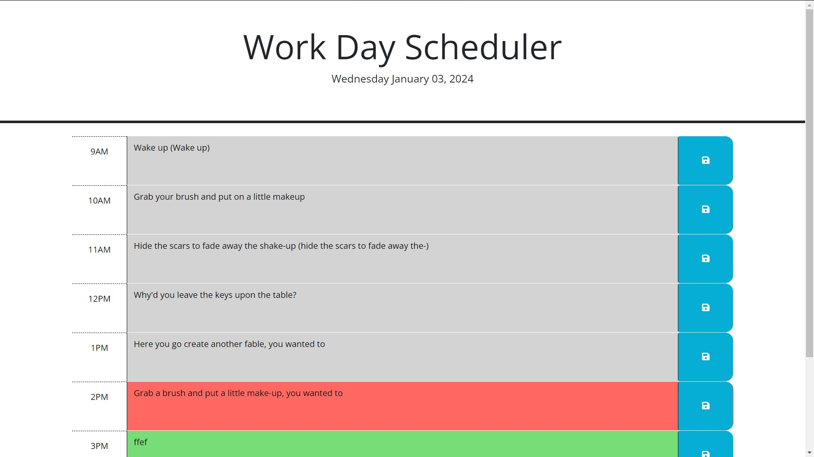

# Work Day Scheduler

## Description

This application is an online weekday scheduler. It provides the user with the current date, and sections based on
the hours from 9am-5pm to write notes and make a to-do list. The note for each hour persists when the user closes the app in the web browser and reopens it. 

- This application helps the user organize their day. 
- I built this program to practice the use of the day.js library and to practice the use of classes in a javascript project.
- I learned about reading the documentation for an outside library and playing with the available formats to find one that best fit the application. I also learned about using classes in JavaScript and learned some oddities and limitations that I had to work around, and plan to practice more in the future. 

## Credits

Credit for the design and overall structure of the application goes to UNC Coding Bootcamp. All JavaScript code in script.js was programmed solely by me. 
